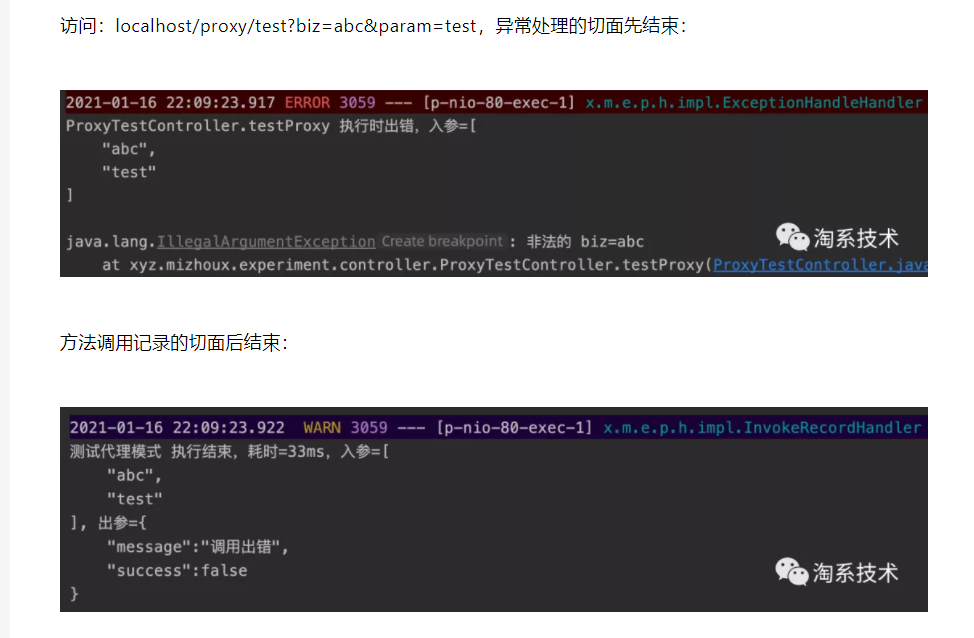

https://developer.aliyun.com/article/786372?spm=a2c6h.14164896.0.0.5f7c7e9bRMfKPJ

+ 小编：可以看到抛出异常时， InvokeRecordHandler 的 onThrow 方法没有执行，为什么呢？
+ 之叶：因为 InvokeRecordAspect 比 ExceptionHandleAspect 在更外层，外层的 InvokeRecordAspect 在执行时，执行的已经是内层的 ExceptionHandleAspect 代理过的方法，而对应的 ExceptionHandleHandler 已经把异常 “消化” 了，即 ExceptionHandleAspect 代理过的方法已经不会再抛出异常。
+ 小编：如果我们要 限制单位时间内方法的调用次数，比如 3s 内用户只能提交表单 1 次，似乎也可以通过这个代理模式的套路来实现。
+ 之叶：小场面。首先定义好注解（注解可以包含单位时间、最大调用次数等参数），然后在方法切面处理器的 onBefore 方法里面，使用缓存记录下单位时间内用户的提交次数，如果超出最大调用次数，返回 false，那么目标方法就不被允许调用了；然后在 getOnForbid 的方法里面，返回这种情况下的响应。